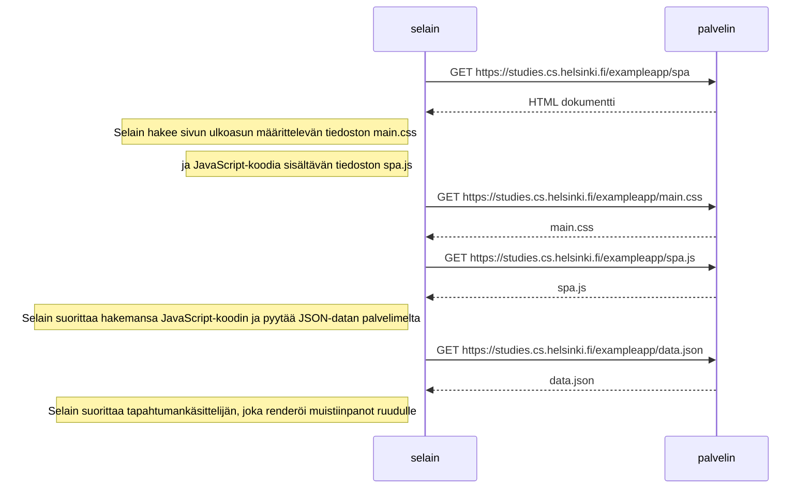

Tehtävä 0.5: Single Page App
Kaavio tilanteesta, jossa käyttäjä menee selaimella osoitteeseen https://studies.cs.helsinki.fi/exampleapp/spa.

```mermaid
sequenceDiagram
  participant selain
  participant palvelin

  selain->>palvelin: GET https://studies.cs.helsinki.fi/exampleapp/spa
  palvelin-->>selain: HTML dokumentti
  Note left of selain: Selain hakee sivun ulkoasun määrittelevän tiedoston main.css
  Note left of selain: ja JavaScript-koodia sisältävän tiedoston spa.js
  selain->>palvelin: GET https://studies.cs.helsinki.fi/exampleapp/main.css
  palvelin-->>selain: main.css
  selain->>palvelin: GET https://studies.cs.helsinki.fi/exampleapp/spa.js
  palvelin-->>selain: spa.js
  Note left of selain: Selain suorittaa hakemansa JavaScript-koodin ja pyytää JSON-datan palvelimelta
  selain->>palvelin: GET https://studies.cs.helsinki.fi/exampleapp/data.json
  palvelin-->>selain: data.json
  Note left of selain: Selain suorittaa tapahtumankäsittelijän, joka renderöi muistiinpanot ruudulle

```
