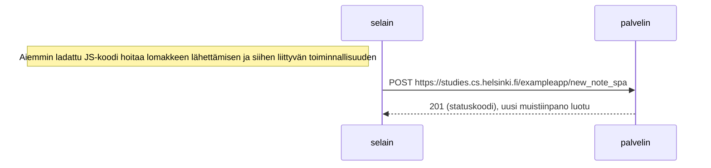

Tehtävä 0.6: Uusi muistiinpano

Kaavio tilanteesta, jossa käyttäjä luo uuden muistiinpanon single page ‑versiossa.

```mermaid
sequenceDiagram
  participant selain
  participant palvelin

  Note left of selain: Aiemmin ladattu JS-koodi hoitaa lomakkeen lähettämisen ja siihen liittyvän toiminnallisuuden
  selain->>palvelin: POST https://studies.cs.helsinki.fi/exampleapp/new_note_spa
  palvelin-->>selain: 201 (statuskoodi), uusi muistiinpano luotu
  

```
